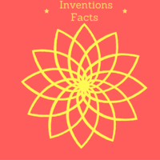

#Invention Facts

 
Invention Facts is an Alexa Skill. 
 

 
Invention Facts is a skill of the top inventions that have changed our way of life.
 

To use the Invention Facts skill, try saying...

Alexa, ask Invention Facts for a fact.

Alexa, ask Invention Facts to tell me a fact.

Alexa, ask Invention Facts for a new fact.

Invocation Name: Invention Facts

Category: null

ID: amzn1.echo-sdk-ams.app.cf87cc59-24b6-4f21-9d9d-ef8ae09442ba

ASIN: B01HMZG5RC

Author: Cheryl Troup

Release Date: June 28, 2016 @ 06:16:19

In-App Purchasing: No

[Alexa Amazon Skill - Invention Facts](http://alexa.amazon.com/spa/index.html#skills/dp/B01HMZG5RC/?ref=skill_dsk_skb_sr_0)

]
